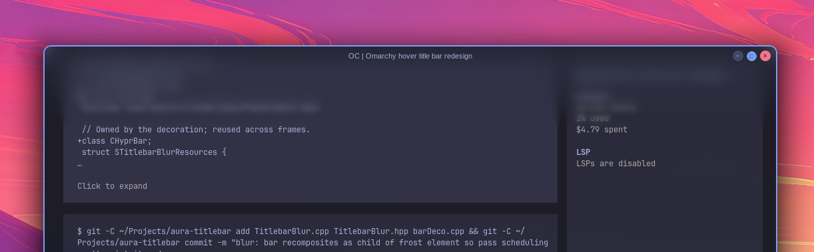
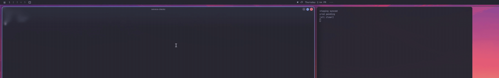

<div align="center">

# aura-titlebar

**A hover-revealed title bar that slides down over your app windows.**
*Spring-loaded, gradually blurred, and always out of the way.*


</div>



---

A Hyprland compositor plugin that gives every window an iPhone-style title
bar: **nothing is visible until you deliberately hover the very top of a
window** — then the bar springs down over the app content with one continuous
motion, frosted with a progressive blur so the title and window controls read
crisply at any scale. Move away, and it melts back — leaving only the
compositor border you already had.

```
  ┌──────────────────────────────────────────────┐
  │              My Window Title          ● ● ●  │  ← slides down on hover,
  ├──────────────────────────────────────────────┤    spring + overshoot,
  │        ░░░ progressive blur shoulder ░░░     │    frosted shoulders,
  │                                              │    zero layout shift
  │              app content, untouched          │
  └──────────────────────────────────────────────┘
```

> Upstream: `hyprbars` [hyprwm/hyprland-plugins](https://github.com/hyprwm/hyprland-plugins)
> redesigned — hover reveal, overlay geometry, spring motion, a compositor
> gradual-blur matte, and interactive button animations.

---

## Why it feels different

| | Stock `hyprbars` | **aura-titlebar** |
| --- | --- | --- |
| Layout | reserves a strip (app gets shorter) | **zero layout shift** — overlays the window |
| When visible | always | **10px deliberate hover dip only** |
| Motion | none | **spring slide-down**, overshoot + settle |
| Blur | flat blur of the strip | **continuous progressive blur** that melts into the content |
| Border | optional own border | **never** — your theme's border is the only border |
| Buttons | static, fixed hit targets | **staggered spring cascade**, hover/press states, fixed hit areas |
| Clicks when hidden | "invisible but clickable" (upstream #690) | **pass through to the app** |
| Maximized / fullscreen | hidden by rule | **bar still reachable** — it is your way back out |
| Corner radii | outer curve | **your theme's inner curve** at any radius & rounding power |

## Features

- **Deliberate hover trigger** — `bar_hover_zone` (default 10px). Chrome- and
  Firefox-style app UI (tabs, toolbars) at 20–40px depth stays untouched; the
  full strip keeps the bar alive *after* it is revealed.
- **Progressive frosted glass** — a quarter-resolution scalar matte computed
  from your window's real rounded edge drives live compositor blur; the falloff
  is smooth, two-axis, corner-radius aware, and costs ~nothing when idle.
  The bar slides **with** the frost; text and buttons always render on top,
  pixel-crisp.
- **Communicative controls** — close / maximize / minimize cascade in
  right-to-left on the reveal spring (ease-out-back scale from 0.6×, ease-out
  cubic alpha), enlarge +12% and brighten on hover, compress while pressed,
  fire on release, and cascade away in reverse on hide.
- **Real dragging semantics** — a 4px movement threshold means jitter never
  grabs the window; dragging preserves size and grab offset, detaching tiled
  and fullscreen windows natively; touch dragging too, no forced retiling.
- **Theme-native** — reads the omarchy theme colors, honors `rounding` and
  `rounding_power`, rides your `windowsIn` spring curve for the reveal.
- **No click-eating** — while hidden, the bar's region belongs to your app,
  fully. Resolves the long-standing invisible-clickable-area bug upstream.
- **ABI-guarded** — refuses to load on a Hyprland whose ABI string doesn't
  match the build, notifying instead of crashing.

## Install

```sh
git clone https://github.com/Sh3nron/omarchy-aura-titlebar.git
cd aura-titlebar
./setup.sh
```

`setup.sh` builds against your installed Hyprland headers, installs the
plugin by **atomic rename** (`aura_titlebar-<timestamp>.so` — the running
compositor's mapped binary is never touched), and loads it. A hook in
`~/.config/hypr/autostart.lua` loads the newest version at every login.
Requirements: `hyprland`, `cmake`, `gcc`, `pkgconf`, matching dev headers
(`hyprpm headers`).

## Update

```sh
./setup.sh        # builds + installs a new versioned .so
# the new version activates at your next login (or restart the session)
```

Remove:

```sh
./uninstall.sh
```

## Configure

Everything lives in `~/.config/hypr/looknfeel.lua`, inside a guarded
`hl.plugin.aura_titlebar { … }` block — the theme color block reads
`~/.local/state/omarchy/current/theme/colors.toml` automatically:

```lua
hl.config({
  plugin = {
    aura_titlebar = {
      enabled              = true,
      bar_height           = 28,
      bar_color            = colors.background,
      bar_gradual_blur     = true,   -- progressive frosted shoulders
      bar_blur_reach       = 96,     -- melt length below the strip
      bar_blur_strength    = 2.0,
      bar_tint_opacity     = 0.20,
      bar_title_enabled    = true,
      bar_text_size        = 11,
      bar_text_weight      = "medium",
      bar_text_align       = "center",
      bar_buttons_alignment = "right",
      bar_button_scale     = 1.5,    -- enlarge all window controls
      bar_buttons_pop      = true,   -- staggered cascade animation
      bar_button_padding   = 5,
      bar_padding          = 8,
      bar_hover_zone       = 10,     -- reveal trigger depth (px)
      reveal_on_hover      = true,
      icon_on_hover        = false,
      inactive_button_color = colors.muted,
      col                  = { text = colors.foreground },
      on_double_click      = [[…maximize toggle…]],
    },
  },
})
```

Buttons are registered right-to-left (the first declaration is the
rightmost control):

```lua
hl.plugin.aura_titlebar.add_button({
  bg_color = colors.red, fg_color = colors.background,
  size = 11, icon = "×",
  action = [[hyprctl dispatch 'hl.dsp.window.close()']],
})
hl.plugin.aura_titlebar.add_button({ bg_color = colors.accent,  size = 10, icon = "□", action = [[…maximize…]] })
hl.plugin.aura_titlebar.add_button({ bg_color = colors.muted,   size = 11, icon = "−", action = "omarchy-shell window-controls minimize" })
```

Most options apply live with `omarchy restart hyprctl`; binary changes need
a `./setup.sh` + re-login (the safe-update rule: never rewrite a `.so` the
running compositor has mapped).

Dynamic window rules (same syntax as hyprbars):
`aura_titlebar:no_bar`, `aura_titlebar:bar_color`,
`aura_titlebar:title_color`.

## Behavior notes

- The reveal rides the **`windowsIn` animation leaf** — tune its spring in
  `looknfeel.lua` to shape the whole motion.
- Buttons animate around their **resting centers**; hit-testing always uses
  final geometry, so clicks during the cascade never miss.
- When hidden (and while a reveal animation plays), presses on the strip pass
  through to the app. The bar turns interactive at ~60% of the slide.
- Press-and-hold keeps the bar up even off-window, so dragging a window away
  mid-press works; fullscreen windows likewise keep escape controls.
- Touch dragging preserves size and grab point — no retiling on release.

## Testing

Interaction regressions run in an isolated nested Hyprland instance with a
synthetic virtual pointer (never your desktop) — see `tests/INTERACTIONS.md`.

## Credits & license

- `barDeco` interaction machinery, pass-element plumbing, and overall design
  lineage: [`hyprwm/hyprland-plugins` `hyprbars`](https://github.com/hyprwm/hyprland-plugins)
  — BSD-3-Clause (`LICENSE`).
- The **gradual blur matte** system (quarter-res SDF matte + live
  `blurMainFramebuffer` compositing): derived from
  [aura-blur](https://github.com/Sh3nron/omarchy-aura-blur), itself modeled
  on the [ReactBits GradualBlur](https://reactbits.dev/animations/gradual-blur)
  falloff.
- Everything hover, spring, and cascade specific on top: © 2026 Yeshuah
  Franco, MIT.

Assembled for [Omarchy](https://omarchy.org).<div align="center">
  
  <p><em>Cursor dips into the top of a window: the frosted bar with title and controls springs down, then melts back away.</em></p>
</div>


